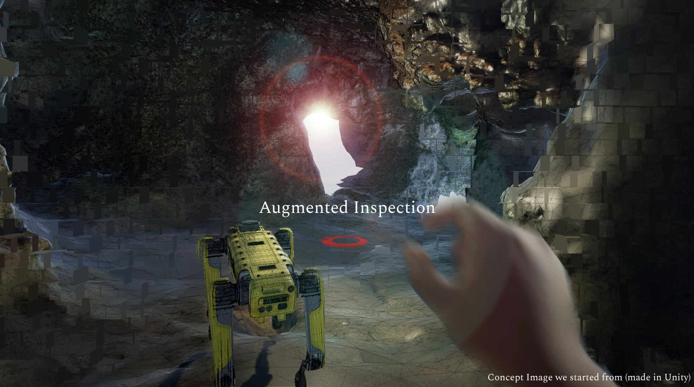

# Augmented Inspection and Teleoperation Project



## Overview

This project is developed using **Unity 2022.3.38f1** and **Apple Vision Pro OS Template 1.3.1**. It explores the potential of **augmented reality (AR)** for **inspection and teleoperation** tasks, enabling users to interact with a physical environment through immersive augmented interfaces.

The project leverages Unity's AR capabilities in combination with the Apple Vision Pro, focusing on enhanced workflows for **remote monitoring**, **robotic control**, and **visual feedback**.

See details at 
https://docs.google.com/presentation/d/19J8hxo8IiWyNzzQIFGkX9_B_qeUiCcJHosvsiL6Bcvs/edit?usp=sharing

## Features

- **Augmented Inspection**: Allows users to inspect environments, machinery, or objects with overlaid data in real time using the Apple Vision Pro.
- **Teleoperation Interface**: Remote control and monitoring of a connected robotic system via the AR interface.
- **Head and Hand Tracking**: Full support for Vision Pro’s head and hand gestures to interact with the augmented environment.
- **Synthetic Data Collection**: Captures user interactions and environmental data for further training and optimization.
- **Visual Feedback**: Displays real-time data such as sensor information or point clouds overlaid on the physical environment.

## Requirements

- **Unity 2022.3.38f1** (or newer)
- **Apple Vision Pro OS Template 1.3.1**
- **Mac with Apple Silicon** (for testing and deployment)
- **Apple Vision Pro Headset** (for AR experience)

## Installation

1. Clone the repository:
   ```bash
   git clone https://github.com/yourusername/augmented-inspection-teleoperation.git
   ```
2. Open the project in **Unity 2022.3.38f1**.
3. Ensure the **Apple Vision Pro OS Template 1.3.1** package is installed via the Unity Package Manager.
4. Build and deploy the project to your **Apple Vision Pro** device.

## Usage

1. Wear the **Apple Vision Pro** headset.
2. Open the application via the Vision Pro launcher.
3. Select the **Augmented Inspection** mode to begin inspecting environments.
4. Use hand gestures and head movements to interact with overlaid AR data.
5. For **Teleoperation**, connect to the robotic system (like a Boston Dynamics Spot robot) through the Unity interface and control its movements remotely.

## Project Structure

```
Root
│
├── Assets
│   ├── Scripts
│   ├── Prefabs
│   ├── Materials
│
├── ProjectSettings
│
└── README.md
```

## License

This project is licensed under the MIT License - see the [LICENSE](LICENSE) file for details.
